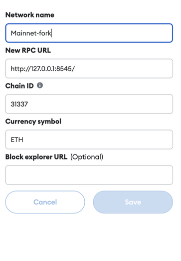

## Screencast

https://www.dropbox.com/s/r4dlxaacbeloqj7/DappUniversityScreenCast.mp4?dl=0


## Getting Started

Install dependencies for hardhat and frontend:

```bash
npm install
cd ./frontend
npm install
```

Launch local node - fork from mainnet - this should always run in background:
```bash
npm run node
```

Open another terminal and deploy contract:
```bash
npm run deploy
```

Take contract address and paste it as parameter `YIELD_AGGREGATOR_ADDRESS` into `frontend/src/config.ts`
```
> yield-aggregator@1.0.0 deploy
> npx hardhat run scripts/deploy.ts --network localhost

Aggregator contract address: 0xAe2563b4315469bF6bdD41A6ea26157dE57Ed94e
Deployer: 0xf39Fd6e51aad88F6F4ce6aB8827279cffFb92266
```

frontend/src/config.ts:
```
export const WETH_MAINNET_ADDRESS = "0xC02aaA39b223FE8D0A0e5C4F27eAD9083C756Cc2";
export const YIELD_AGGREGATOR_ADDRESS = "0x687bB6c57915aa2529EfC7D2a26668855e022fAE";
```

Start frontend in another terminal:
```bash
npm run ui
```

Import deployer private key to metamask - the Account #0:
```
> yield-aggregator@1.0.0 node
> npx hardhat node

Started HTTP and WebSocket JSON-RPC server at http://127.0.0.1:8545/

Accounts
========

WARNING: These accounts, and their private keys, are publicly known.
Any funds sent to them on Mainnet or any other live network WILL BE LOST.

Account #0: 0xf39Fd6e51aad88F6F4ce6aB8827279cffFb92266 (10000 ETH)
Private Key: 0xac0974bec39a17e36ba4a6b4d238ff944bacb478cbed5efcae784d7bf4f2ff80
```

Add mainnet-fork network to Metamask:




Open browser at `http://localhost:3000/`, choose mainnet-fork network in Metamask and Account #0

Connect Metamask accound with Dapp and you ready to go!


